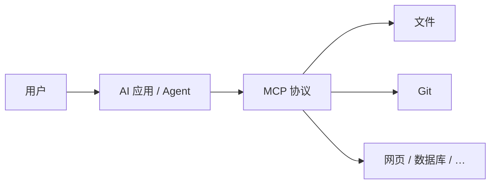
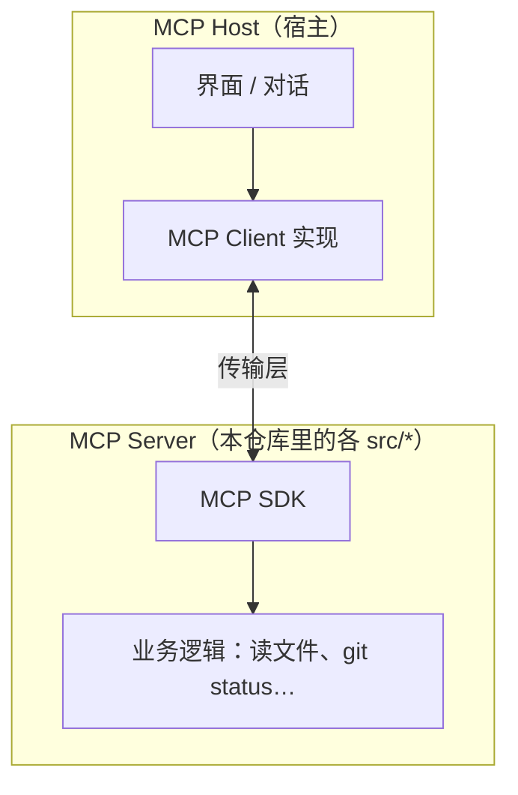

# MCP 基础

> 上一篇：无 · 下一篇：[02-入门.md](./02-入门.md)

## 1. MCP 是什么？

**Model Context Protocol（模型上下文协议）** 是一套开放标准，用来让 **AI 应用（客户端）** 以统一方式连接 **外部能力（MCP Server）**。

可以把它理解成：

- 对大模型来说：一组可被调用的 **工具（Tools）**、可读取的 **资源（Resources）**、可复用的 **提示模板（Prompts）**；
- 对开发者来说：一个 **子进程或 HTTP 服务**，用 JSON-RPC 说同一种「方言」。



**和「直接调 OpenAI API」的区别：**

| 方式 | 特点 |
|------|------|
| 直接 API | 模型只能处理你塞进对话里的文本 |
| MCP | 模型通过客户端 **按需调用** 外部工具，结果再进上下文 |

**和「普通插件 / 脚本」的区别：**

- 有标准消息格式（初始化、列工具、调工具、读资源等）；
- 客户端可按同一套逻辑连接多个 server；
- 生态里有 Registry、Inspector、多语言 SDK。

---

## 2. 四个核心角色



| 角色 | 谁 | 做什么 |
|------|-----|--------|
| **Host** | Cursor、Claude Desktop、VS Code Copilot 等 | 承载对话，内嵌或调用 MCP Client |
| **Client** | Host 里的 MCP 模块 | 启动 Server、发 `tools/list`、`tools/call` 等 |
| **Server** | `server-memory`、`mcp-server-git` 等 | 注册工具并实现具体能力 |
| **Transport** | 多为 **stdio**；也可 SSE / HTTP | 承载 JSON-RPC 字节流 |

你日常说的「配置 MCP」，其实是告诉 **Host**：用哪条 shell 命令 **spawn** 哪个 **Server**。

---

## 3. 协议里常见的「原语」

| 原语 | 含义 | 本仓库示例 |
|------|------|------------|
| **Tools** | 模型可调用的函数 | `read_text_file`、`git_status`、`fetch` |
| **Resources** | 可读的数据源（URI） | `everything` 里的演示资源 |
| **Prompts** | 预置提示模板 | `everything` 里的多种 prompt |
| **Roots** | 客户端声明「允许访问的目录」 | `filesystem` 优先用 Roots 做沙箱 |

一次对话里典型顺序：

1. Client 启动 Server 子进程  
2. **initialize** — 交换能力与版本  
3. **tools/list** — 模型知道有哪些工具  
4. 用户提问 → 模型决定 **tools/call**  
5. Server 执行并返回结果 → 模型继续生成回答  

---

## 4. 传输方式（Transport）

| 类型 | 场景 | 本仓库 |
|------|------|--------|
| **stdio** | 本地子进程，stdin/stdout 传 JSON | 默认；memory、filesystem、git 等 |
| **SSE / HTTP** | 远程或多客户端 |  mainly `everything` 演示 |

入门阶段 **只需记住 stdio**：配置里的 `command` + `args` 启动进程即可。

---

## 5. 本仓库（servers）在生态里的位置

本 monorepo 提供 **7 个参考 Server**，用于：

- 演示 MCP SDK 用法；
- 给 Client 开发者做兼容性测试；
- 教学 — **不是**开箱即用的生产级产品。

```
src/
  everything/           # 协议全家桶（测试用）
  filesystem/           # 安全文件操作
  memory/               # 知识图谱记忆
  sequentialthinking/   # 分步推理工具
  fetch/                # 网页抓取（Python）
  git/                  # Git 操作（Python）
  time/                 # 时区（Python）
```

更完整的第三方 server 列表见 [MCP Registry](https://registry.modelcontextprotocol.io/)，不在本 README 里维护。

---

## 6. 需要 API Key 吗？（基础结论）

**对本仓库这 7 个参考实现：一般不需要** GitHub Token、Brave Key 等。

你需要准备的是：

1. **能跑命令的环境**（Node 22、`npx`，或 Python + `uvx`）  
2. **客户端里的 MCP 配置**（启动命令与路径参数）  
3. **使用 AI 产品本身的账号**（与 MCP Server 无关）

个别 server 只有 **可选** 环境变量（如 memory 的文件路径），见 [02-入门.md](./02-入门.md) 的配置表。

---

## 7. 自测：是否理解基础

- [ ] 能说出 Host、Client、Server 各指什么  
- [ ] 知道 Tools 与 Resources 的区别  
- [ ] 明白配置 MCP = 配置「如何启动子进程」  
- [ ] 知道本仓库是参考实现，不是 Registry 全集  

准备好后，进入 **[02-入门.md](./02-入门.md)** 在 Cursor 或 Claude Desktop 里接上一个 server。
