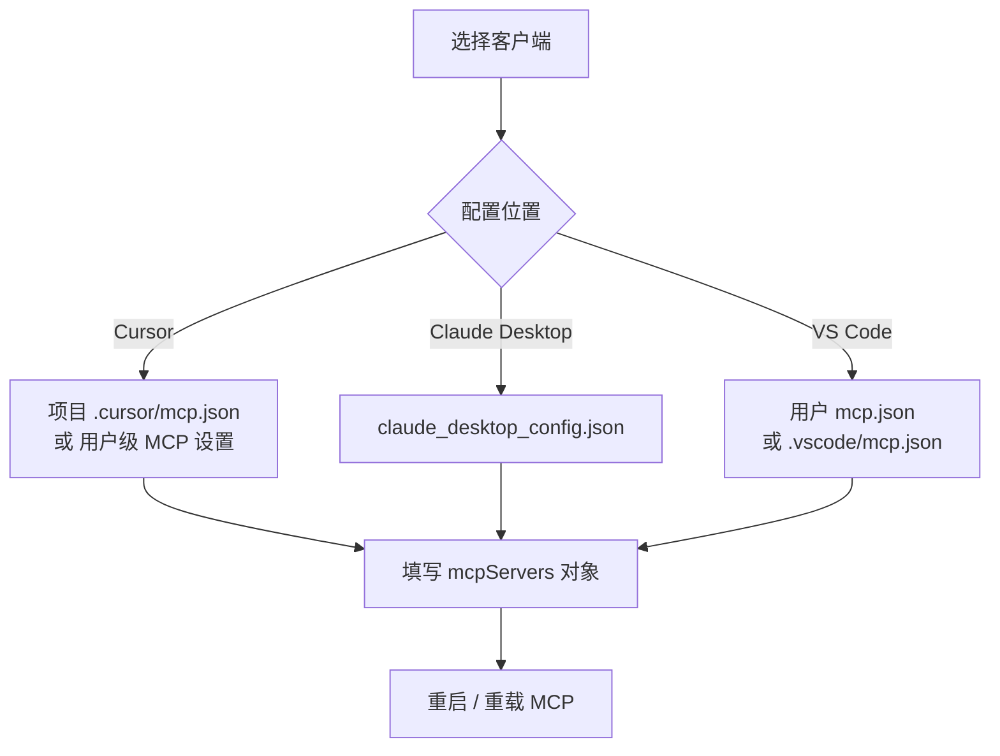
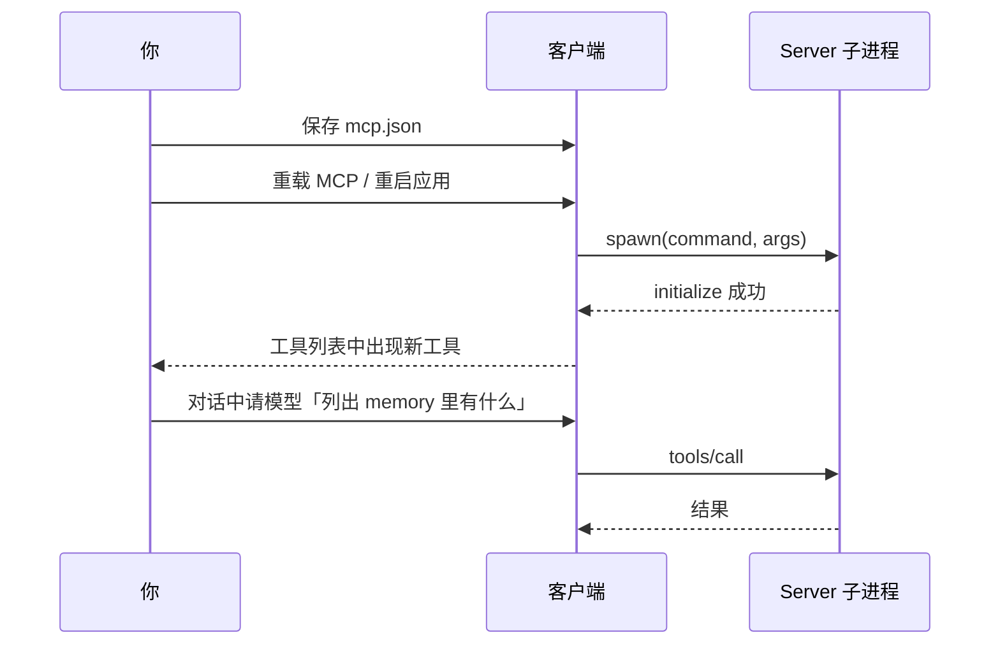

# MCP 入门：配置与第一次调用

> 上一篇：[01-基础.md](./01-基础.md) · 下一篇：[03-进阶.md](./03-进阶.md)

## 1. 环境准备

| 用途 | 要求 |
|------|------|
| TypeScript 服务器（memory、filesystem 等） | **Node.js 22**、`npx` 可用 |
| Python 服务器（git、fetch、time） | **`uv`** 与 **`uvx`**（推荐）或 `pip` |
| 客户端 | Cursor、Claude Desktop、VS Code（带 MCP 支持）等 |

安装 uv（Python 工具链）：

```bash
# macOS / Linux 示例，其它平台见官方文档
curl -LsSf https://astral.sh/uv/install.sh | sh
```

验证：

```bash
node -v    # 应为 v22.x
npx -y @modelcontextprotocol/server-memory --help 2>/dev/null || true
uvx --version
```

---

## 2. 配置放在哪？



核心结构（各客户端键名可能略有差异，Claude 用 `mcpServers`，VS Code 有时用 `servers`）：

```json
{
  "mcpServers": {
    "服务器别名": {
      "command": "启动命令",
      "args": ["参数1", "参数2"],
      "env": { "可选环境变量": "值" }
    }
  }
}
```

**没有统一的「MCP API Key」字段** — 除非某个第三方 server 文档明确要求（本仓库 7 个默认不需要）。

---

## 3. 推荐：先接一个 memory（零路径参数）

**macOS / Linux（Cursor / Claude Desktop）：**

```json
{
  "mcpServers": {
    "memory": {
      "command": "npx",
      "args": ["-y", "@modelcontextprotocol/server-memory"]
    }
  }
}
```

**Windows**（`npx` 需经 `cmd /c`）：

```json
{
  "mcpServers": {
    "memory": {
      "command": "cmd",
      "args": ["/c", "npx", "-y", "@modelcontextprotocol/server-memory"]
    }
  }
}
```

可选：指定记忆文件路径

```json
"env": {
  "MEMORY_FILE_PATH": "/Users/你/文档/mcp-memory.jsonl"
}
```

---

## 4. 再接 filesystem（必须限定目录）

将 `/path/to/allowed` 换成你允许 AI 读写的真实目录：

```json
{
  "mcpServers": {
    "filesystem": {
      "command": "npx",
      "args": [
        "-y",
        "@modelcontextprotocol/server-filesystem",
        "/path/to/allowed"
      ]
    }
  }
}
```

安全提示：**只填你愿意被工具读写的目录**，不要用系统根目录或 home 全盘。

---

## 5. 再接 git（Python / uvx）

```json
{
  "mcpServers": {
    "git": {
      "command": "uvx",
      "args": [
        "mcp-server-git",
        "--repository",
        "/path/to/your/git/repo"
      ]
    }
  }
}
```

---

## 6. 本仓库 7 个 server 配置速查

| Server | 启动方式示例 | 是否必需 Key | 常见额外配置 |
|--------|----------------|-------------|--------------|
| memory | `npx -y @modelcontextprotocol/server-memory` | 否 | `MEMORY_FILE_PATH` |
| filesystem | `npx … server-filesystem <目录>` | 否 | 目录路径或客户端 Roots |
| sequentialthinking | `npx … server-sequential-thinking` | 否 | `DISABLE_THOUGHT_LOGGING` |
| everything | `npx … server-everything` | 否 | 测试用，非日常 |
| git | `uvx mcp-server-git --repository <路径>` | 否 | 仓库路径 |
| fetch | `uvx mcp-server-fetch` | 否 | `--ignore-robots-txt` 等 |
| time | `uvx mcp-server-time` | 否 | `--local-timezone` |

各 server 细节见 `src/<name>/README.md`。

---

## 7. 配置生效流程



### 如何确认已成功？

1. 客户端 **MCP 设置** 里该 server 状态为已连接 / 无报错  
2. Agent 工具列表能看到 `create_entities`、`read_text_file`、`git_status` 等  
3. 让模型执行一次简单操作（如 `git status` 或 `list_allowed_directories`）

### 常见失败

| 现象 | 可能原因 |
|------|----------|
| 找不到 `npx` / `uvx` | 未安装 Node / uv，或 PATH 在 GUI 应用中不同 |
| filesystem 启动即报错 | 未传允许目录，且客户端不支持 Roots |
| Windows 下 npx 超时 | 未使用 `cmd /c` 包装 |
| 403 / 无工具 | 配置 JSON 语法错误或未重载 |

---

## 8. 用对话触发工具（示例话术）

配置 **memory** 后：

> 请用 memory 工具记住：我常用 TypeScript。然后 read_graph 给我看当前记忆。

配置 **filesystem** 后：

> 请 list_allowed_directories，再读取某允许目录下的 README.md 前几行。

配置 **git** 后：

> 对当前仓库执行 git_status，并用中文总结。

模型是否调用工具由 **客户端 + 模型** 决定；若未调用，可明确说「请使用 MCP 工具 xxx」。

---

## 9. 入门自检

- [ ] 至少成功连接 1 个 server（建议 memory）  
- [ ] 理解 `command` / `args` / `env` 三个字段  
- [ ] 知道 filesystem 必须限制路径  
- [ ] 区分「AI 产品账号」与「MCP server 配置」  

下一步：[03-进阶.md](./03-进阶.md) — 源码构建、协议细节、调试与安全。
