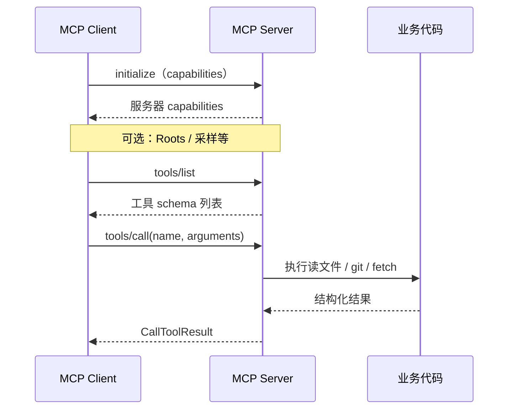
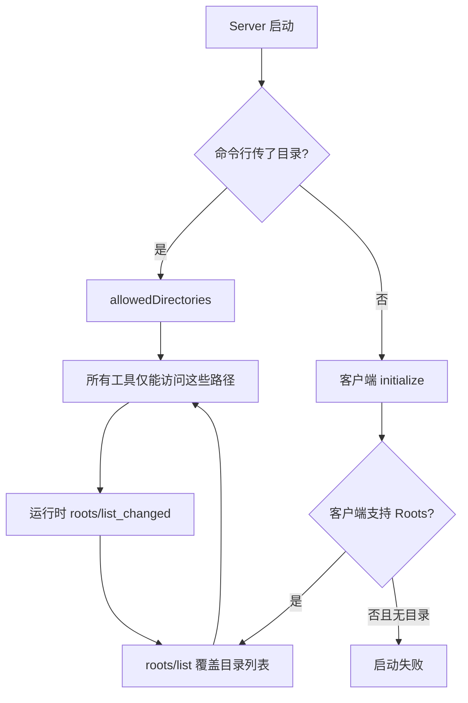
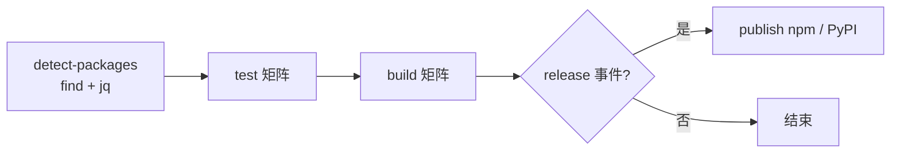

# MCP 进阶：原理、开发调试与安全

> 上一篇：[02-入门.md](./02-入门.md) · 下一篇：[04-高阶.md](./04-高阶.md)

## 1. 从源码运行本仓库

克隆后不必等 npm 发布，可直接在 `src/<server>` 开发：

### TypeScript 包

**请逐行执行**（不要整段粘成一行；`cd` 行后不要跟其它命令）：

```bash
cd src/memory
npm ci
npm run build
npm test
node dist/index.js
```

> 若在仓库根目录误跑了 `npm ci` / `npm run build`，会触发所有 workspace 构建，且根目录没有 `test` 脚本。开发单个 server 时务必先 `cd src/<server>`。

其它 TS 包将 `memory` 换成 `filesystem`、`everything`、`sequentialthinking` 即可。

根目录一次性构建**所有** TS workspace（需先能成功 `npm install`）：

```bash
cd /path/to/servers
npm install
npm run build
```

若根目录 `npm ci` 报 `ENOTEMPTY`，可先清理再装：

```bash
rm -rf node_modules src/*/node_modules
npm install
```

### Python 包

```bash
cd src/git   # 或 fetch、time
uv sync --frozen --all-extras --dev
uv run pytest
uv run pyright
uv run mcp-server-git --help
```

在客户端里把 `npx` / `uvx` 换成 **本地路径** 调试示例（git）：

```json
{
  "mcpServers": {
    "git-dev": {
      "command": "uv",
      "args": [
        "--directory",
        "/绝对路径/servers/src/git",
        "run",
        "mcp-server-git",
        "--repository",
        "/你的/仓库"
      ]
    }
  }
}
```

---

## 2. 协议交互（实现视角）



本仓库 TS 服务器的通用模式：

1. 创建 `McpServer`（`@modelcontextprotocol/sdk`）  
2. `server.tool(...)` / `registerTools(server)` 注册 Zod 校验过的入参  
3. `new StdioServerTransport()` + `await server.connect(transport)`  

Python 服务器在 `serve()` 协程里用官方 Python SDK 完成同等注册。

---

## 3. Filesystem 与 Roots（重要）

`filesystem` 有两种授权目录的方式：



要点：

- **Roots 由客户端提供**时，会 **完全替换** 服务端命令行目录；  
- 无目录且无 Roots → server 拒绝工作（故意设计，防止全盘访问）；  
- 用 `list_allowed_directories` 工具可审计当前允许路径。

进阶阅读：`src/filesystem/README.md`。

---

## 4. 各 server 环境变量与行为开关

| 变量 / 参数 | Server | 作用 |
|-------------|--------|------|
| `MEMORY_FILE_PATH` | memory | 自定义 `jsonl` 存储路径 |
| `DISABLE_THOUGHT_LOGGING` | sequentialthinking | 关闭思考日志 |
| `--repository` | git | 默认 Git 仓库根 |
| `--ignore-robots-txt` | fetch | 忽略 robots.txt |
| `--user-agent` / `--proxy-url` | fetch | 自定义 UA / 代理 |
| `--local-timezone` | time | 覆盖系统时区 |
| `PORT` | everything (HTTP) | HTTP 传输端口 |
| `GZIP_*` | everything | 演示用抓取限制 |

**fetch 安全：** 可访问内网 IP，勿在生产环境无隔离地暴露。见 `SECURITY.md`。

---

## 5. 使用 MCP Inspector 调试

不经过完整客户端，直接测 server：

```bash
# 已发布的包
npx @modelcontextprotocol/inspector npx -y @modelcontextprotocol/server-memory

# 本地 Python 开发
cd src/git
npx @modelcontextprotocol/inspector uv run mcp-server-git
```

Inspector 可手动发 `tools/list`、`tools/call`，适合排查 schema 或权限问题。

Claude Desktop 日志（macOS 示例）：

```bash
tail -n 50 -f ~/Library/Logs/Claude/mcp*.log
```

---

## 6. Tool Annotations（客户端提示）

MCP 允许为工具标注：

| 字段 | 含义 |
|------|------|
| `readOnlyHint: true` | 只读，无副作用 |
| `idempotentHint: true` | 相同参数重试相对安全 |
| `destructiveHint: true` | 可能破坏或覆盖数据 |

`filesystem` 在 README 中有完整对照表；实现时应在注册工具时传入，便于 Host 做 UI 提示或策略过滤。

---

## 7. 本仓库 CI/CD（monorepo）

GitHub Actions 对 **TypeScript**、**Python** 各有一条流水线（见 `CLAUDE.md`）：



- **动态检测**：在 `src/` 下找所有 `package.json` / `pyproject.toml`，无需手写包列表；  
- **PR / push**：只测 + 构建，**不发布**；  
- **GitHub Release**：才 `npm publish` / PyPI Trusted Publishing。

本地贡献前建议：

```bash
cd src/<server> && npm test   # 或 uv run pytest
```

---

## 8. 安全与贡献边界

- 参考实现 **非生产默认方案**；自行评估威胁模型。  
- 本仓库 **不接受** 新的 server 实现 PR → 请发到 [MCP Registry](https://github.com/modelcontextprotocol/registry)。  
- 漏洞报告：SDK 走各 SDK 仓库；本仓库见 [SECURITY.md](../../SECURITY.md)。

---

## 9. 进阶自检

- [ ] 能从源码 build 并本地挂到客户端调试  
- [ ] 能解释 initialize → tools/call 顺序  
- [ ] 理解 filesystem 的 Roots 与路径沙箱  
- [ ] 会用 Inspector 或日志排查连接失败  

下一步：[04-高阶.md](./04-高阶.md) — 自研 server、多传输、扩展 everything、发布。
