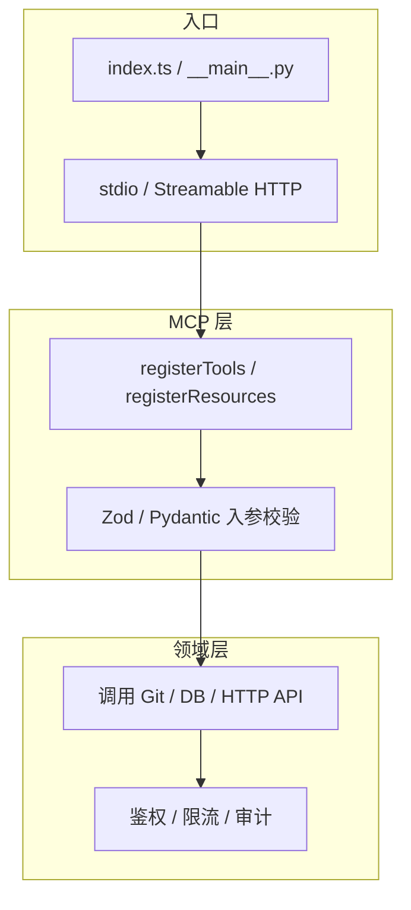
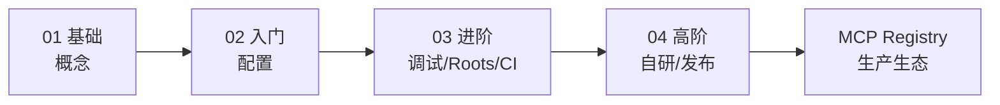

# MCP 高阶：自研 Server、扩展与发布

> 上一篇：[03-进阶.md](./03-进阶.md)

## 1. 何时应该自研 MCP Server？

适合：

- 要把 **内部系统**（工单、CMDB、专有 API）以标准方式接到多种 AI 客户端；  
- 需要 **细粒度权限**、审计、多租户；  
- 已有服务希望 **复用** 为 Tools/Resources，而不是复制粘贴 API 文档进 prompt。

不必自研：

- 仅需一次性脚本 → 普通 CLI 或 Agent 的 `run_terminal_cmd` 可能足够；  
- 能力已在 Registry 有成熟 server → 优先复用。

本仓库是 **教学用参考代码**；生产级 server 建议独立仓库并发布到 Registry。

---

## 2. 自研架构（推荐分层）



原则：

- **Transport 与业务解耦** — 同一套 `registerTools` 可挂 stdio 或 HTTP；  
- **入参必须 schema 化** — 减少模型乱传参；  
- **默认最小权限** — 参考 `filesystem` 的路径白名单思路。

---

## 3. TypeScript Server 最小骨架

依赖（与现有一致）：

- `@modelcontextprotocol/sdk`  
- `zod`  

逻辑步骤：

```typescript
import { McpServer } from "@modelcontextprotocol/sdk/server/mcp.js";
import { StdioServerTransport } from "@modelcontextprotocol/sdk/server/stdio.js";
import { z } from "zod";

const server = new McpServer({
  name: "my-server",
  version: "1.0.0",
});

server.tool(
  "get-status",
  "返回服务状态",
  { detail: z.string().optional() },
  async ({ detail }) => ({
    content: [{ type: "text", text: `ok${detail ? `: ${detail}` : ""}` }],
  }),
  {
    readOnlyHint: true,
  },
);

const transport = new StdioServerTransport();
await server.connect(transport);
```

对照本仓库：

| 模式 | 参考文件 |
|------|----------|
| 单文件注册 | `src/sequentialthinking/index.ts` |
| 模块化 `registerTools` | `src/everything/tools/index.ts` |
| 初始化后钩子 | `src/filesystem/index.ts` 的 `oninitialized` + Roots |

---

## 4. Python Server 最小骨架

参考 `src/git/src/mcp_server_git/server.py`、`src/fetch/.../server.py`：

- 使用官方 Python MCP SDK；  
- `async def serve()` + stdio；  
- 用 `click` 或 `argparse` 暴露 `--repository` 等 CLI 参数；  
- 测试用 `pytest` + `pytest-asyncio`（fetch）。

构建发布用 **hatchling** + `uv build`，与 CI 一致。

---

## 5. 扩展 Everything Server（协议试验场）

`src/everything` 刻意实现 **几乎全部 MCP 能力**，适合：

- 新 Client 特性联调（采样、sampling、多传输）；  
- 学习 Resources / Prompts / 订阅更新；  
- 新增演示型 tool 而不污染其它 server。

扩展步骤（详见 `src/everything/docs/extension.md`）：

1. 在 `tools/` / `resources/` / `prompts/` 下新增模块；  
2. 导出 `registerX(server)`；  
3. 在对应 `index.ts` 聚合注册；  
4. 更新 `docs/features.md`；  
5. `npm test` + Inspector 验证。

传输切换：

```bash
cd src/everything
npm run start:stdio          # 默认
npm run start:streamableHttp # HTTP 联调
```

---

## 6. 多传输与远程部署

| 传输 | 优点 | 注意 |
|------|------|------|
| stdio | 简单、本地默认 | 一进程通常一对一会话 |
| Streamable HTTP | 远程、多会话 | 需处理鉴权、TLS、会话粘滞 |
| SSE（旧） | 兼容旧客户端 | 规范已倾向 Streamable HTTP |

高阶部署 checklist：

- [ ] 反向代理 + HTTPS  
- [ ] OAuth / API Token（**这时才需要 Key**，由**你**的 server 定义）  
- [ ] 网络隔离（尤其 fetch 类）  
- [ ] 请求日志与速率限制  

Everything 的 HTTP 实现见 `src/everything/transports/streamableHttp.ts`。

---

## 7. 设计生产级 Server 的额外能力

Registry 与社区常见增强（本参考仓库大多 **未** 内置）：

| 能力 | 说明 |
|------|------|
| 认证 | OAuth 2.1、API Key、mTLS |
| 多租户 | 按租户隔离 Roots / 数据 |
| 审计 | 记录每次 `tools/call` 与参数 |
| 动态工具发现 | 按用户角色下发不同 `tools/list` |
| 版本化 | 协议版本与 server 版本协商 |

可参考社区框架（见根 [README.md](../../README.md) 框架一节），或在 Registry 查找现成 server。

---

## 8. 发布与版本（对齐本仓库 CI）

### npm（TypeScript）

- 包名形如 `@modelcontextprotocol/server-*`；  
- Release 时 workflow 对每个 TS 包执行 `npm publish`；  
- 需维护 `NPM_TOKEN`（仅官方维护者）。

### PyPI（Python）

- 包名形如 `mcp-server-git`；  
- `uv build` 产出 wheel/sdist；  
- Release 使用 **PyPI Trusted Publishing**（`id-token: write`）。

### 发布你自己的 server

1. 独立仓库 + 清晰 README；  
2. 按 [Registry quickstart](https://github.com/modelcontextprotocol/registry/blob/main/docs/modelcontextprotocol-io/quickstart.mdx) 登记；  
3. **不要** 向本 `servers` 仓库 PR 新 server 实现（见 [CONTRIBUTING.md](../../CONTRIBUTING.md)）。

---

## 9. 高阶实践清单

**协议与实现**

- [ ] 工具名动词开头、`kebab-case`（与 CLAUDE.md 一致）  
- [ ] 为写操作设置 `destructiveHint` / `idempotentHint`  
- [ ] 支持 Resources 或 Prompts（不仅 Tools）以通过 PR 审查倾向  

**安全**

- [ ] 默认拒绝、显式授权（路径 / token scope）  
- [ ] 不把密钥写进 repo；用客户端 `env` 注入  
- [ ] 对出站请求（fetch）做 SSRF 防护  

**工程**

- [ ] vitest / pytest 覆盖核心工具逻辑  
- [ ] PR 附 LLM 客户端实测说明（见 `.github/pull_request_template.md`）  

---

## 10. 学习路径回顾



| 文档 | 你应达到的能力 |
|------|----------------|
| [01-基础](./01-基础.md) | 讲清 MCP 角色与原语 |
| [02-入门](./02-入门.md) | 独立配置并验证 2+ server |
| [03-进阶](./03-进阶.md) | 源码调试、Roots、Inspector |
| [04-高阶](./04-高阶.md) | 设计并实现可发布 server |

**外部必读：**

- 协议规范：<https://modelcontextprotocol.io/specification>  
- Schema：<https://github.com/modelcontextprotocol/modelcontextprotocol/tree/main/schema>  
- 本仓库开发约定：[CLAUDE.md](../../CLAUDE.md)

---

若你计划基于本 fork 维护中文版文档，可在根 `README.md` 增加指向 `docs/guide/` 的链接；需要我代为添加时说一声即可。
